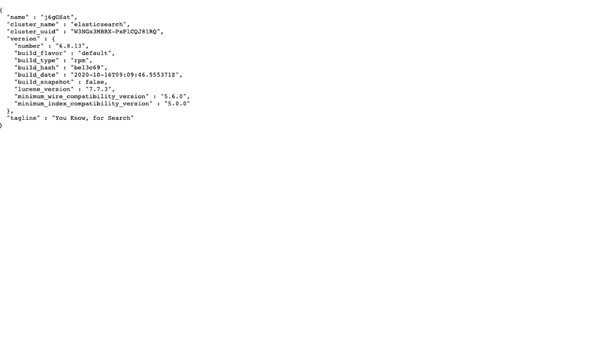
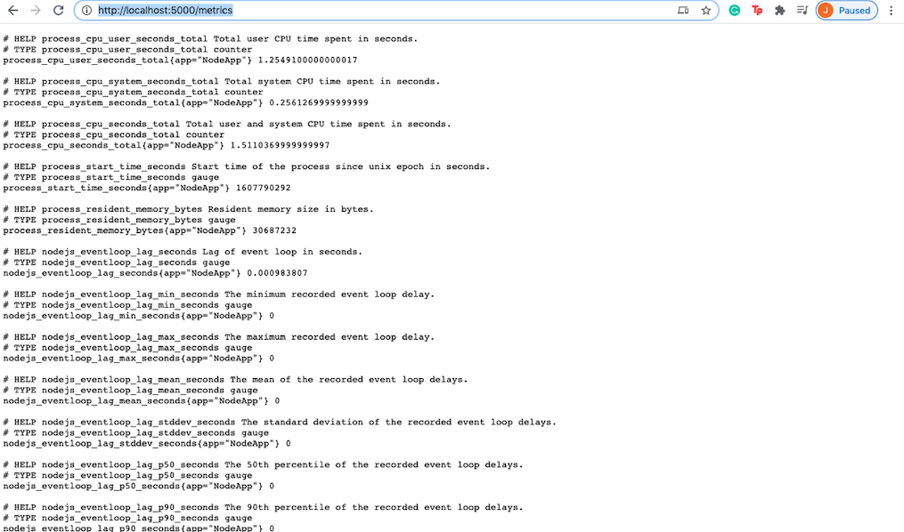
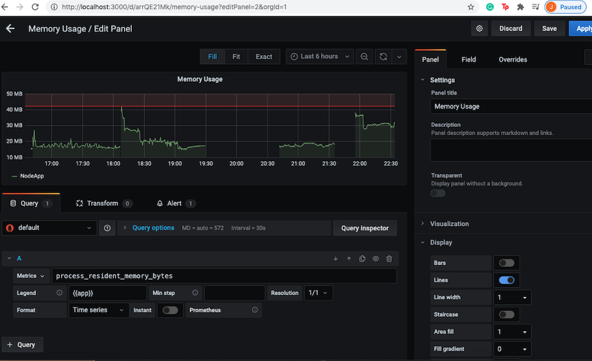

# Node-App

Dockerizing a simple NodeJS App

1. Create a project directory and clone the repository..(redis and ES to be changed)
    > mkdir <directory_name>

    > git clone https://github.com/jmathiasj/node-app.git
  
2. A package.json file consists of the app dependencies Running the command to install all the dependencies  
    > npm install
3. Running the command will run the app.js
    > npm start
  
The Application can be accessed on : [http://localhost:5000/](http://localhost:5000/)


To run the same NodeJs application inside a docker container an image needs to created 

Steps to create a Docker Image for the NodeJS application
   
4. To create a **Dockerfile**
    > touch Dockerfile
5. The following is added in the Dockerfile
```
    FROM node:10.16.0-alpine
    WORKDIR /app
    COPY package*.json /app
    RUN npm install
    COPY . /app
    EXPOSE 5000
    CMD ["npm", "start"]

```
6. A **.dockerignore** file is created and the following is added
 
```
    node_modules
```
   
7. To build the docker image
    > docker build -t node-app .
<!--     
    <p align="center">
        
      </p> -->
8. To check Docker images
    > docker images
    
    <!-- <p align="center">
        
      </p> -->
9. To run the docker image
    > docker run -p 5000:5000 -d node-app
 
10. To get the container id
    > docker ps
    
    <!-- <p align="center">
        
      </p>
       -->
11. The application can be accessed on: [http://localhost:5000/](http://localhost:5000/)
  
  <!-- <p align="center">
        
      </p> -->

Elasticsearch and Kibana

1. Install Elasticsearch and Kibana on an EC2 instance preferrably version 6.x and above on an EC2 instance
Ref Link: https://github.com/soumilshah1995/AWS-Elastic-Search-and-kibana-Deploy/blob/master/README.md

  <p align="center">
        
      </p>

2. Install the elasticsearch npm module
  > npm install elasticsearch

3. The following code is added to the app.js

```
  const elasticsearch = require('elasticsearch');

  const esClient = new elasticsearch.Client({
  hosts: ['http://<elasticsearchendpoint>:<port mostly 9200 for ES>'],
   }); // Elasticsearch


```
4. create Index 'userconf'(any name) in ES

5. Add the following code to store the data to ES

```
app.get('/elastic', (req, res) => {
  const IP = req.clientIp;
  const userAgent = req.useragent.source;
  esClient.index({
    index: 'userconf',
    body: {
      ip: IP,
      useragent: userAgent,
    },
  }).then((resp) => {
    console.log('User config', resp);
    res.send('succesful');
  }).catch((err) => console.log('Error', err));
});
```
 [The User IP/User Agent is dummy data and the IP and UA can be searched through the endpooints - (/search-ua/:ua)(/search-ip/:ip)]

 6. Visualise on the Kibana dashboard usually accessible on port 5601


Prometheus and Grafana monitoring for NodeJS App

1. Install prom-client npm module
  > npm install prom-client

2.  The following code is added to app.js
  ```
   const prClient = require('prom-client');
   const register = new prClient.Registry();

    register.setDefaultLabels({
      app: 'NodeApp',
    });
  
    prClient.collectDefaultMetrics({ register });
   //code to create metrics
  ```
3. Create prometheus.yml file in the project directory and add the following
```
global:
  scrape_interval: 10s
scrape_configs:
  - job_name: "NodeApp"
    static_configs:
      - targets: ["docker.for.mac.host.internal:5000"]

```
4. The docker run command  is used to run the Prometheus docker container

>$ docker run -d -p 9090:9090 -v ~/prometheus.yml:/etc/prometheus/prometheus.yml prom/prometheus -config.file=/etc/prometheus/prometheus.yml

5. Access http://localhost:5000/metrics route 

<p align="center">
        
      </p>

5. A datasources.yml file is created for the Grafan Config and the following is added
  ```
    apiVersion: 1
    datasources:
      - name: Prometheus
        type: prometheus
        access: proxy
        orgId: 1
        url: http://docker.for.mac.host.internal:9090
        basicAuth: false
        isDefault: true
        editable: true
  ```
6. To run the Grafana docker container:

>$ docker run --rm -p 3000:3000 \
-e GF_AUTH_DISABLE_LOGIN_FORM=true \
 -e GF_AUTH_ANONYMOUS_ENABLED=true \
-e GF_AUTH_ANONYMOUS_ORG_ROLE=Admin \
-v `pwd`/datasources.yml:/etc/grafana/provisioning/datasources/datasources.yml \
grafana/grafana:7.1.5

7. The Grafana Dashboard can be accessed on http://localhost:3000


8. Dashboards can be created on Grafana as well as alerts can be set for eg
<p align="center">
        
      </p>
